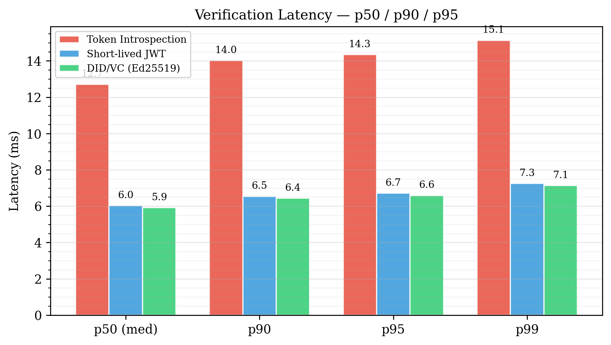
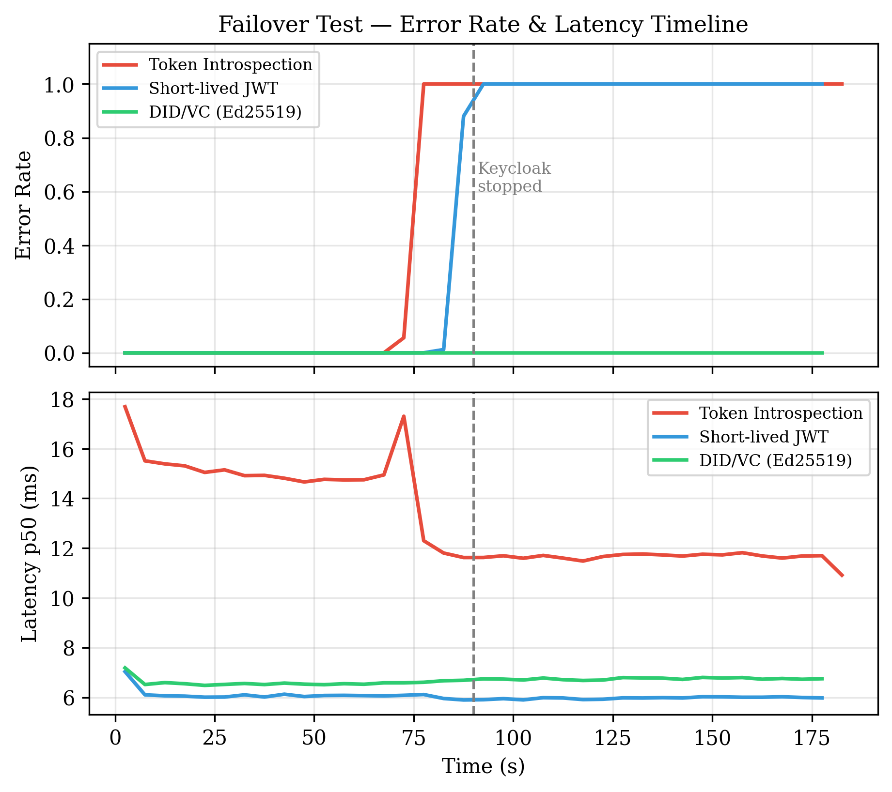

# ZT Benchmark — Zero Trust Identity Verification

[](LICENSE)

Experimental comparison of three cross-domain identity verification mechanisms
in a multi-cloud Zero Trust environment.

## Architecture

```
Hetzner VM 1 (IdP)         GCP VM (Resource)            Hetzner VM 2 (Load Gen)
┌──────────────────┐       ┌──────────────────────┐      ┌──────────────────┐
│                  │       │                      │      │                  │
│   Keycloak       │◄──────│   Service B          │◄─────│   k6             │
│   :8080          │       │   :8081              │      │                  │
│                  │       │                      │      │                  │
└──────────────────┘       └──────────────────────┘      └──────────────────┘
  "IdP domain"               "Resource domain"             "Client domain"
  Hetzner Cloud               GCP                           Hetzner Cloud
```

## Scenarios

| # | Endpoint                         | Mechanism                      | Keycloak dependency          |
|---|----------------------------------|--------------------------------|------------------------------|
| 1 | POST /api/resource/introspection | Token Introspection (RFC 7662) | Every request (SPOF)         |
| 2 | POST /api/resource/jwt           | Short-lived JWT (30 s TTL)     | Token refresh only (~30 s)   |
| 3 | POST /api/resource/vc            | DID/VC (Ed25519, local)        | None — fully decentralized   |

**Load profile (identical across all three scenarios):**

| Phase    | Duration | Rate              | Purpose                        |
|----------|----------|-------------------|--------------------------------|
| Steady   | 40 s     | 200 req/s         | Warm baseline                  |
| Ramp     | 80 s     | 200 → 1 000 req/s | Stress test (3-stage ramp)     |
| Cooldown | 40 s     | 200 req/s         | Recovery check                 |

## Deployment

All services are deployed automatically via GitHub Actions on push to `master`.
See `.github/workflows/` for details.

### Required GitHub Secrets

| Secret | Used by | Value |
|---|---|---|
| `HETZNER_HOST` | Keycloak deploy, Service B deploy | Hetzner VM 1 IP |
| `HETZNER_USER` | Keycloak deploy | SSH username |
| `HETZNER_SSH_KEY` | Keycloak deploy | Private SSH key |
| `KEYCLOAK_ADMIN` | Keycloak deploy | Admin username |
| `KEYCLOAK_ADMIN_PASSWORD` | Keycloak deploy | Admin password |
| `GCP_HOST` | Service B deploy | GCP VM IP |
| `GCP_USER` | Service B deploy | SSH username |
| `GCP_SSH_KEY` | Service B deploy | Private SSH key |
| `KEYCLOAK_REALM` | Service B deploy | `zt-benchmark` |
| `KEYCLOAK_CLIENT_ID` | Service B deploy | `service-b` |
| `KEYCLOAK_CLIENT_SECRET` | Service B deploy | `service-b-secret` |
| `TRUSTED_ISSUER_PUBLIC_KEY` | Service B deploy | Base64 key from `generate_vp.py` |

## Setup

### Step 1 — Generate Ed25519 keypair

Run once on your local machine before first deployment:

```bash
pip3 install cryptography
python3 scripts/generate_vp.py
# → creates vp.json (used by k6) and public_key.txt
# → copy public_key.txt content into the TRUSTED_ISSUER_PUBLIC_KEY GitHub secret
```

### Step 2 — Push to master

GitHub Actions will:
1. Build and push `keycloak-zt` image to GHCR → deploy to Hetzner VM 1
2. Build and push `service-b` image to GHCR → deploy to GCP VM

Keycloak starts with the `zt-benchmark` realm pre-configured and `dev/dev` user
provisioned automatically via `init-users.sh`.

### Step 3 — Hetzner VM 2: Install k6

```bash
sudo gpg --no-default-keyring \
  --keyring /usr/share/keyrings/k6-archive-keyring.gpg \
  --keyserver hkp://keyserver.ubuntu.com:80 \
  --recv-keys C5AD17C747E3415A3642D57D77C6C491D6AC1D69
echo "deb [signed-by=/usr/share/keyrings/k6-archive-keyring.gpg] https://dl.k6.io/deb stable main" \
  | sudo tee /etc/apt/sources.list.d/k6.list
sudo apt-get update && sudo apt-get install -y k6

# Copy vp.json (generated in Step 1) to this machine
scp vp.json <HETZNER_VM2_USER>@<HETZNER_VM2_IP>:~/zt-benchmark/
```

### Step 4 — Configure `.env` on the k6 server

Create `zt-benchmark/.env` on Hetzner VM 2 with:

```bash
SERVICE_B_IP=<GCP_VM_IP>
KEYCLOAK_IP=<HETZNER_VM1_IP>:8080
KC_CLIENT_SECRET=service-a-secret
```

### Step 5 — Run benchmarks

Each script auto-timestamps its output to `results/` and never overwrites previous runs.

```bash
# Measure baseline RTT before tests
ping -c 20 <GCP_VM_IP> | tail -1

# Scenario 1: Token Introspection
bash k6/run-scenario-1.sh
# → results/introspection_summary_<ts>.json

sleep 120

# Scenario 2: Short-lived JWT (per-VU token refresh, TTL=30s)
bash k6/run-scenario-2.sh
# → results/jwt_summary_<ts>.json

sleep 120

# Scenario 3: DID/VC (Ed25519, fully local)
bash k6/run-scenario-3.sh
# → results/vc_summary_<ts>.json
```

> **Note:** No manual token fetch is needed. Scenarios 1 and 2 handle token
> acquisition automatically per VU. Scenario 3 uses `vp.json` (pre-generated
> in Step 1) — no Keycloak contact at all.

### Step 6 — Failover test

```bash
# Terminal 1: start all three scenarios concurrently for 180 s
bash k6/run-failover.sh
# → results/failover_raw_<ts>.json   (NDJSON for timeline chart)
# → results/failover_summary_<ts>.json

# Terminal 2: stop Keycloak at the ~90 s mark
ssh root@<HETZNER_VM1_IP> "docker stop keycloak"
```

Expected failure modes after Keycloak stops:
- **Introspection** — fails immediately (every request calls Keycloak)
- **JWT** — fails ~30 s later (local verification holds until token TTL expires)
- **VC** — never fails (fully local Ed25519, zero IdP dependency)

### Step 7 — Generate figures

```bash
pip3 install matplotlib numpy
python3 scripts/plot_results.py \
  --introspection results/introspection_summary_<ts>.json \
  --jwt           results/jwt_summary_<ts>.json \
  --vc            results/vc_summary_<ts>.json \
  --failover      results/failover_raw_<ts>.json \
  --keycloak-stop 90 \
  --output-dir    results/
# → results/fig1_latency.png
# → results/fig2_errors.png
# → results/fig3_failover.png
```

## Local Development

```bash
docker network create zt-local

# Keycloak
docker build -t keycloak-zt ./keycloak
docker run -d --name keycloak --network zt-local -p 8080:8080 \
  -e KEYCLOAK_ADMIN=admin -e KEYCLOAK_ADMIN_PASSWORD=admin \
  keycloak-zt

# Service B (after Keycloak is ready)
docker build -t service-b-zt ./service-b
docker run -d --name service-b --network zt-local -p 8081:8081 \
  -e KEYCLOAK_URL=http://keycloak:8080 \
  -e KEYCLOAK_REALM=zt-benchmark \
  -e KEYCLOAK_CLIENT_ID=service-b \
  -e KEYCLOAK_CLIENT_SECRET=service-b-secret \
  -e TRUSTED_ISSUER_PUBLIC_KEY=$(cat scripts/public_key.txt) \
  service-b-zt

# Get token
TOKEN=$(curl -s -X POST http://localhost:8080/realms/zt-benchmark/protocol/openid-connect/token \
  -d "grant_type=password&client_id=service-a&client_secret=service-a-secret&username=dev&password=dev" \
  | jq -r .access_token)

curl -s -X POST http://localhost:8081/api/resource/introspection -H "Authorization: Bearer $TOKEN" | jq
curl -s -X POST http://localhost:8081/api/resource/jwt           -H "Authorization: Bearer $TOKEN" | jq
curl -s -X POST http://localhost:8081/api/resource/vc \
  -H "Content-Type: application/json" -d @vp.json | jq
```

## Project Structure

```
zt-benchmark/
├── .github/workflows/
│   ├── deploy-keycloak.yml            # Build & deploy Keycloak → Hetzner VM 1
│   └── deploy-service-b.yml           # Build & deploy Service B → GCP VM
├── keycloak/
│   ├── Dockerfile                     # Keycloak 24 + baked-in realm
│   ├── realm-export.json              # zt-benchmark realm (accessTokenLifespan=30s)
│   └── init-users.sh                  # Provisions dev/dev via kcadm at startup
├── service-b/                         # Spring Boot resource service (GCP VM)
│   ├── Dockerfile
│   ├── pom.xml
│   └── src/main/java/com/zt/benchmark/
│       ├── controller/ResourceController.java
│       └── service/
│           ├── IntrospectionVerificationService.java  # Scenario 1: calls Keycloak every request
│           ├── JwtVerificationService.java            # Scenario 2: local JWKS verify
│           └── VcVerificationService.java             # Scenario 3: local Ed25519 verify
├── k6/                                # Load test scripts (run on Hetzner VM 2)
│   ├── scenario-1-introspection.js    # Token Introspection load test
│   ├── scenario-2-jwt-refresh.js      # Short-lived JWT with per-VU auto-refresh
│   ├── scenario-3-vc.js               # DID/VC Ed25519 load test
│   ├── failover-test.js               # All three concurrently, Keycloak stopped mid-run
│   ├── run-scenario-1.sh              # Wrapper: timestamped summary export
│   ├── run-scenario-2.sh
│   ├── run-scenario-3.sh
│   └── run-failover.sh                # Wrapper: both raw NDJSON + summary export
├── scripts/
│   ├── generate_vp.py                 # One-time Ed25519 keypair + VP generation
│   └── plot_results.py                # Generate paper figures from k6 outputs
└── experiment_results/                # Raw results committed to repo
    ├── 18-05-2026-morning/            # Run 1: scenarios 1-3 + failover
    ├── 18-05-2026-noonday/            # Run 2: scenarios 1-3 + failover (canonical)
    ├── 18-05-2026-evening/            # Run 3: scenarios 1-3 + failover
    └── deprecated/14-05-2026/        # Earlier run (different log format, superseded)
```

## Results

All experiments were run on a real multi-cloud topology:
- **Service B** (resource server): GCP `e2-standard-4` (4 vCPU, 16 GB, Intel Broadwell), europe-west3-a
- **Keycloak** (IdP): Hetzner CCX13, 4 vCPU, EU-West
- **k6** (load generator): Hetzner CPX21, EU-West
- Cross-cloud RTT (k6 → Service B): ~100 ms

Three independent runs were performed on 18 May 2026 (morning, noonday, evening).
Results below are from the **noonday** run — the most stressed, with Service B reaching
99.5 % peak CPU on Token Introspection. The other two runs are consistent within ±3 ms.

### Verification Latency — Load Test (18 May 2026, noonday)

Load: 200 req/s steady → ramp to 1 000 req/s → 200 req/s cooldown (160 s total).

| Scenario            | Avg (ms) | p50 (ms) | p90 (ms) | p95 (ms) | p99 (ms) | Error rate |
|---------------------|----------|----------|----------|----------|----------|------------|
| Token Introspection |   15.68  |   12.90  |   15.18  |   16.55  |   20.78  | 0 %        |
| Short-lived JWT     |    7.13  |    6.79  |    8.60  |    9.56  |   12.27  | 0 %        |
| DID/VC (Ed25519)    |    6.50  |    6.16  |    6.78  |    7.00  |    8.05  | 0 %        |

**Key findings:**
- Token Introspection latency is **2.4× higher** on average than local-verification methods — every request pays an extra cross-domain round-trip to Keycloak.
- JWT and DID/VC show near-identical median latency (6.79 ms vs 6.16 ms), confirming that the Ed25519 signature check adds negligible overhead over JWKS verification.
- Under the 1 000 req/s ramp, Introspection p99 (20.78 ms) is 2.6× its p50 (12.90 ms), showing Keycloak back-pressure under load; JWT and VC p99/p50 ratios remain ≤ 1.8×.
- All three scenarios maintained 0 % error rate across all three runs.



### Resource Utilization — Load Test (18 May 2026, noonday)

CPU and RAM collected via `sar -u -r 1` on both VMs for the full test duration.

**Service B** (GCP `e2-standard-4`, 4 vCPU / 16 GB, europe-west3-a):

| Scenario            | CPU avg | CPU peak | RAM avg | RAM peak |
|---------------------|---------|----------|---------|----------|
| Token Introspection | 51.8 %  |  99.5 %  |  7.8 %  |  8.8 %   |
| Short-lived JWT     | 35.4 %  |  87.2 %  |  7.2 %  |  7.4 %   |
| DID/VC (Ed25519)    | 35.6 %  |  82.1 %  |  7.3 %  |  7.4 %   |

**Keycloak IdP** (Hetzner CCX13, 4 vCPU, EU-West):

| Scenario            | CPU avg | CPU peak | RAM avg | RAM peak |
|---------------------|---------|----------|---------|----------|
| Token Introspection | 23.2 %  |  45.6 %  | 23.6 %  | 23.8 %   |
| Short-lived JWT     |  0.4 %  |  26.7 %  | 23.6 %  | 23.6 %   |
| DID/VC (Ed25519)    |  0.2 %  |   1.5 %  | 23.6 %  | 23.6 %   |

**Key findings:**
- **Keycloak CPU: 23.2 % (Introspection) vs 0.4 % (JWT) vs 0.2 % (VC)** — Token Introspection drives ~58× more IdP load than JWT at the same request rate. This is the SPOF cost made visible in CPU cycles.
- **Service B CPU 51.8 % (Introspection) vs ~35 % (JWT/VC)** — the extra ~16 % is overhead from maintaining outbound HTTP connections to Keycloak on every single request.
- JWT and DID/VC have virtually identical Service B CPU (35.4 % vs 35.6 %), confirming that local Ed25519 verification is no more expensive than local JWKS/RSA verification.
- Keycloak RAM stays flat across all scenarios — the IdP memory footprint is load-independent; only CPU scales with introspection volume.

### Failover Test — IdP Outage (18 May 2026)

50 req/s per scenario, all three running concurrently for 180 s.  
Keycloak was stopped at the **~90 s mark**.

| Scenario             | Behavior after Keycloak stops         | Recovery |
|----------------------|---------------------------------------|----------|
| Token Introspection  | Fails immediately — 100 % errors      | None until IdP restored |
| Short-lived JWT      | Continues ~30 s, then fails when token TTL expires and refresh is blocked | None until IdP restored |
| DID/VC (Ed25519)     | No impact — 0 % errors throughout     | N/A (never failed) |

**Key finding:** three distinct resilience profiles from the same IdP failure event, demonstrating that the choice of verification mechanism directly determines Zero Trust fault tolerance.


